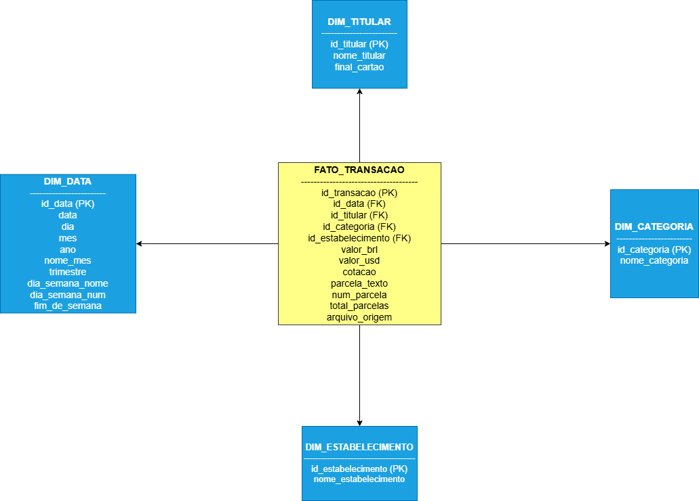

# PROJETO DATA WAREHOUSE E BI

**Transações de Cartão de Crédito**

Fase 1 — Modelagem do Data Warehouse e Dicionário de Dados

Curso: Análise e Desenvolvimento de Sistemas

Período: Março/2025 a Fevereiro/2026

Paulo Henrique Granella

---

## 1. Modelo Dimensional — Star Schema

O modelo adota a arquitetura Star Schema com uma tabela fato central (FATO_TRANSACAO) e quatro dimensões. Cada linha dos arquivos CSV representa um evento transacional e é carregada como um registro individual na tabela fato.

### 1.1 Diagrama

*Feito no draw.io*

### 1.2 Tabelas do Modelo

| **Tabela**            | **Tipo**  | **Descrição**                                                      |
|-----------------------|-----------|--------------------------------------------------------------------|
| FATO_TRANSACAO        | Fato      | Registros individuais de transações (1 linha CSV = 1 linha fato)   |
| DIM_DATA              | Dimensão  | Calendário com atributos temporais derivados da data da compra     |
| DIM_TITULAR           | Dimensão  | Titulares e seus cartões (Nome no Cartão + Final do Cartão)        |
| DIM_CATEGORIA         | Dimensão  | Categorias MCC das transações                                      |
| DIM_ESTABELECIMENTO   | Dimensão  | Estabelecimentos comerciais (coluna Descrição do CSV)              |

---

## 2. Dicionário de Dados

### 2.1 FATO_TRANSACAO

| **Coluna**           | **Tipo**        | **Nulo?** | **Descrição**                                                          |
|----------------------|-----------------|-----------|------------------------------------------------------------------------|
| id_transacao         | SERIAL          | NÃO       | Chave primária surrogate, autoincremento                               |
| id_data              | INTEGER         | NÃO       | FK → DIM_DATA. Identificador da data da compra                         |
| id_titular           | INTEGER         | NÃO       | FK → DIM_TITULAR. Identifica o cartão lógico                           |
| id_categoria         | INTEGER         | NÃO       | FK → DIM_CATEGORIA. Categoria MCC da transação                         |
| id_estabelecimento   | INTEGER         | NÃO       | FK → DIM_ESTABELECIMENTO. Estabelecimento da transação                 |
| valor_brl            | NUMERIC(12,2)   | NÃO       | Valor em reais. Negativo indica estorno ou crédito                     |
| valor_usd            | NUMERIC(10,2)   | SIM       | Valor em dólar. NULL quando não se aplica                              |
| cotacao              | NUMERIC(8,4)    | SIM       | Cotação R$/US$ usada na conversão. NULL quando não se aplica           |
| parcela_texto        | VARCHAR(10)     | SIM       | Texto original da parcela: "Única", "1/3", "2/10", etc.               |
| num_parcela          | SMALLINT        | SIM       | Número da parcela atual (ex.: 1 de "1/3")                             |
| total_parcelas       | SMALLINT        | SIM       | Total de parcelas (ex.: 3 de "1/3"). "Única" → 1                      |
| arquivo_origem       | VARCHAR(60)     | SIM       | Nome do arquivo CSV de origem para rastreabilidade                     |

### 2.2 DIM_DATA

| **Coluna**        | **Tipo**      | **Nulo?** | **Descrição**                                              |
|-------------------|---------------|-----------|------------------------------------------------------------|
| id_data           | INTEGER       | NÃO       | PK. Chave no formato AAAAMMDD (ex.: 20260115)              |
| data              | DATE          | NÃO       | Data completa no formato ISO (AAAA-MM-DD)                  |
| dia               | SMALLINT      | NÃO       | Dia do mês (1 a 31)                                        |
| mes               | SMALLINT      | NÃO       | Mês (1 a 12)                                               |
| nome_mes          | VARCHAR(15)   | NÃO       | Nome do mês em português (ex.: Janeiro)                    |
| trimestre         | SMALLINT      | NÃO       | Trimestre do ano (1 a 4)                                   |
| ano               | SMALLINT      | NÃO       | Ano (ex.: 2025, 2026)                                      |
| dia_semana_num    | SMALLINT      | NÃO       | Dia da semana numérico (0 = Segunda, 6 = Domingo)          |
| dia_semana_nome   | VARCHAR(15)   | NÃO       | Nome do dia em português (ex.: Segunda-feira)              |
| fim_de_semana     | BOOLEAN       | NÃO       | TRUE se o dia for Sábado ou Domingo                        |

### 2.3 DIM_TITULAR

| **Coluna**        | **Tipo**       | **Nulo?** | **Descrição**                                                          |
|-------------------|----------------|-----------|------------------------------------------------------------------------|
| id_titular        | SERIAL         | NÃO       | PK surrogate, autoincremento                                           |
| nome_titular      | VARCHAR(100)   | NÃO       | Nome conforme impresso no cartão (anonimizado)                         |
| final_cartao      | CHAR(4)        | NÃO       | Últimos 4 dígitos do cartão. Combinado com nome forma chave única      |

### 2.4 DIM_CATEGORIA

| **Coluna**        | **Tipo**       | **Nulo?** | **Descrição**                                                                    |
|-------------------|----------------|-----------|----------------------------------------------------------------------------------|
| id_categoria      | SERIAL         | NÃO       | PK surrogate, autoincremento                                                     |
| nome_categoria    | VARCHAR(100)   | NÃO       | Nome da categoria MCC. Valor '-' no CSV é tratado como 'Não Categorizado'        |

### 2.5 DIM_ESTABELECIMENTO

| **Coluna**             | **Tipo**       | **Nulo?** | **Descrição**                                                                     |
|------------------------|----------------|-----------|-----------------------------------------------------------------------------------|
| id_estabelecimento     | SERIAL         | NÃO       | PK surrogate, autoincremento                                                      |
| nome_estabelecimento   | VARCHAR(200)   | NÃO       | Nome bruto do estabelecimento conforme consta na fatura (coluna Descrição do CSV) |